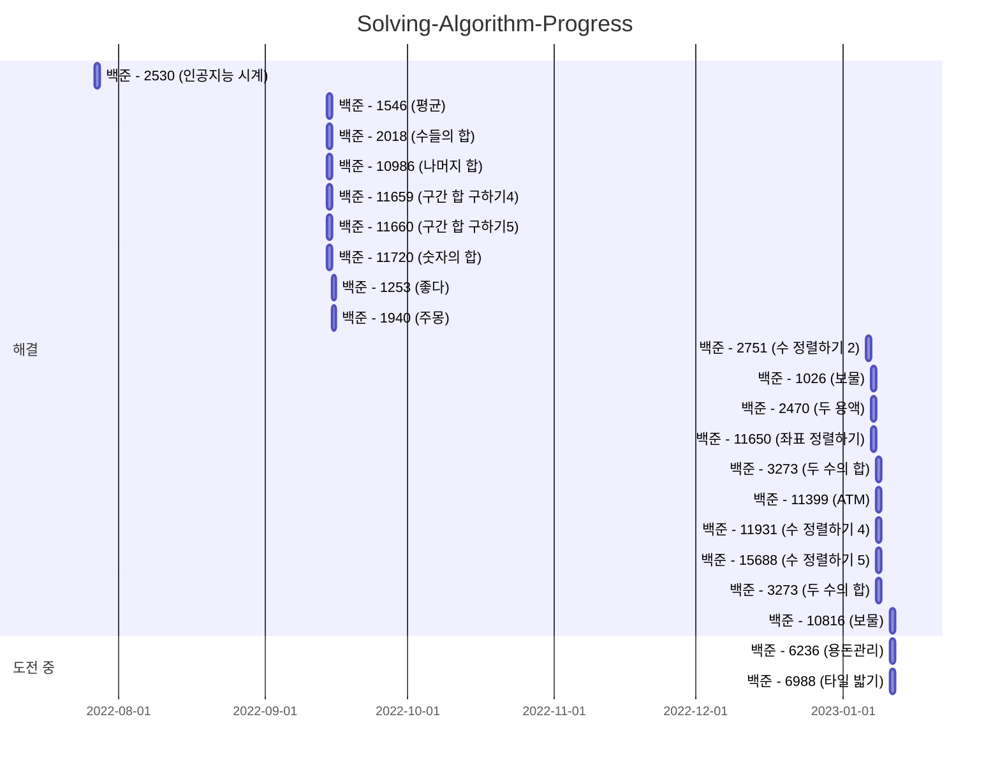

# Algorithm-Baekjoon

## Programming Language

## Problem Table

| 백준                                             |                                                                                                                                                | 프로그래머스                                                                   |                                                                                                                                 | 리트코드 |     |
|------------------------------------------------|------------------------------------------------------------------------------------------------------------------------------------------------|--------------------------------------------------------------------------|---------------------------------------------------------------------------------------------------------------------------------|------|-----|
| 번호                                             | 제목                                                                                                                                             | 번호                                                                       | 제목                                                                                                                              | 번호   | 제목  |
| [1026](https://www.acmicpc.net/problem/1026)   | [보물]                                                                                                                                           | [42746](https://school.programmers.co.kr/learn/courses/30/lessons/42746) | [가장 큰 수]                                                                                                                        |      |     |
| [2470](https://www.acmicpc.net/problem/2470)   | [두 용액](https://github.com/Hell-O-Algorithm/Algorithm-Wiki/blob/main/Baekjoon/Donghun/src/main/java/com/algorithm/baekjun/sort/No2470.java)     | [42747](https://school.programmers.co.kr/learn/courses/30/lessons/42747) | [H-Index](https://github.com/Hell-O-Algorithm/Algorithm-Wiki/blob/main/Programmers/Ryeongee/Programmers%20(lv2)%20H-index.java) |      |     |
| [3273](https://www.acmicpc.net/problem/3273)   | [두 수의 합]                                                                                                                                       | [42748](https://school.programmers.co.kr/learn/courses/30/lessons/42748) | [K번째 수](https://github.com/Hell-O-Algorithm/Algorithm-Wiki/blob/main/Programmers/Ryeongee/K%EB%B2%88%EC%A7%B8%EC%88%98.java)    |      |     |
| [11399](https://www.acmicpc.net/problem/11399) | [ATM]                                                                                                                                          |                                                                          |                                                                                                                                 |      |     |
| [11650](https://www.acmicpc.net/problem/11650) | [좌표 정렬하기](https://github.com/Hell-O-Algorithm/Algorithm-Wiki/blob/main/Baekjoon/Donghun/src/main/java/com/algorithm/baekjun/sort/No11650.java) |                                                                          |                                                                                                                                 |      |     |
| [11931](https://www.acmicpc.net/problem/11931) | [수 정렬하기 4]                                                                                                                                     |                                                                          |                                                                                                                                 |      |     |
| [15688](https://www.acmicpc.net/problem/15688) | [수 정렬하기 5]                                                                                                                                     |                                                                          |                                                                                                                                 |      |     |

### 문제풀이 일정

