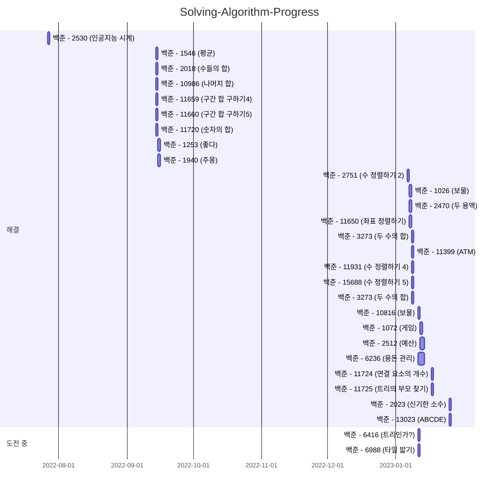

# Algorithm-Baekjoon

## Programming Language

## Problem Table

| 백준                                             |                                                                                                                                                | 프로그래머스                                                                   |                                                                                                                                 | 리트코드 |     |
|------------------------------------------------|------------------------------------------------------------------------------------------------------------------------------------------------|--------------------------------------------------------------------------|---------------------------------------------------------------------------------------------------------------------------------|------|-----|
| 번호                                             | 제목                                                                                                                                             | 번호                                                                       | 제목                                                                                                                              | 번호   | 제목  |
| [1026](https://www.acmicpc.net/problem/1026)   | [보물]                                                                                                                                           | [42746](https://school.programmers.co.kr/learn/courses/30/lessons/42746) | [가장 큰 수]                                                                                                                        |      |     |
| [1072](https://www.acmicpc.net/problem/1072)   | [게임]                                                                                                                                           |                                                                          |                                                                                                                                 |      |     |
| [1253](https://www.acmicpc.net/problem/1253)   | [좋다]                                                                                                                                           |                                                                          |                                                                                                                                 |      |     |
| [1546](https://www.acmicpc.net/problem/1546)   | [평균]                                                                                                                                           |                                                                          |                                                                                                                                 |      |     |
| [1940](https://www.acmicpc.net/problem/1940)   | [주몽]                                                                                                                                           |                                                                          |                                                                                                                                 |      |     |
| [2018](https://www.acmicpc.net/problem/2018)   | [수들의 합]                                                                                                                                        |                                                                          |                                                                                                                                 |      |     |
| [2023](https://www.acmicpc.net/problem/2023)   | [신기한 소수]                                                                                                                                       |                                                                          |                                                                                                                                 |      |     |
| [2470](https://www.acmicpc.net/problem/2470)   | [두 용액](https://github.com/Hell-O-Algorithm/Algorithm-Wiki/blob/main/Baekjoon/Donghun/src/main/java/com/algorithm/baekjun/sort/No2470.java)     | [42747](https://school.programmers.co.kr/learn/courses/30/lessons/42747) | [H-Index](https://github.com/Hell-O-Algorithm/Algorithm-Wiki/blob/main/Programmers/Ryeongee/Programmers%20(lv2)%20H-index.java) |      |     |
| [2512](https://www.acmicpc.net/problem/2512)   | [예산]                                                                                                                                           |                                                                          |                                                                                                                                 |      |     |
| [2530](https://www.acmicpc.net/problem/2530)   | [인공지능 시계]                                                                                                                                      |                                                                          |                                                                                                                                 |      |     |
| [2751](https://www.acmicpc.net/problem/2751)   | [수 정렬하기 2]                                                                                                                                     |                                                                          |                                                                                                                                 |      |     |
| [3273](https://www.acmicpc.net/problem/3273)   | [두 수의 합]                                                                                                                                       | [42748](https://school.programmers.co.kr/learn/courses/30/lessons/42748) | [K번째 수](https://github.com/Hell-O-Algorithm/Algorithm-Wiki/blob/main/Programmers/Ryeongee/K%EB%B2%88%EC%A7%B8%EC%88%98.java)    |      |     |
| [6236](https://www.acmicpc.net/problem/6236)   | [용돈 관리]                                                                                                                                        |                                                                          |                                                                                                                                 |      |     |
| [10986](https://www.acmicpc.net/problem/10986) | [나머지 합]                                                                                                                                        |                                                                          |                                                                                                                                 |      |     |
| [11399](https://www.acmicpc.net/problem/11399) | [ATM]                                                                                                                                          |                                                                          |                                                                                                                                 |      |     |
| [11650](https://www.acmicpc.net/problem/11650) | [좌표 정렬하기](https://github.com/Hell-O-Algorithm/Algorithm-Wiki/blob/main/Baekjoon/Donghun/src/main/java/com/algorithm/baekjun/sort/No11650.java) |                                                                          |                                                                                                                                 |      |     |
| [11659](https://www.acmicpc.net/problem/11659) | [구간 합 구하기 4]                                                                                                                                   |                                                                          |                                                                                                                                 |      |     |
| [11660](https://www.acmicpc.net/problem/11660) | [구간 합 구하기 5]                                                                                                                                   |                                                                          |                                                                                                                                 |      |     |
| [15688](https://www.acmicpc.net/problem/15688) | [수 정렬하기 5]                                                                                                                                     |                                                                          |                                                                                                                                 |      |     |
| [11720](https://www.acmicpc.net/problem/11660) | [숫자의 합]                                                                                                                                        |                                                                          |                                                                                                                                 |      |     |
| [11724](https://www.acmicpc.net/problem/11724) | [연결 요소의 개수]                                                                                                                                    |                                                                          |                                                                                                                                 |      |     |
| [11725](https://www.acmicpc.net/problem/11725) | [트리의 부모 찾기]                                                                                                                                    |                                                                          |                                                                                                                                 |      |     |
| [11931](https://www.acmicpc.net/problem/11931) | [수 정렬하기 4]                                                                                                                                     |                                                                          |                                                                                                                                 |      |     |
| [13023](https://www.acmicpc.net/problem/13023) | [ABCDE]                                                                                                                                        |                                                                          |                                                                                                                                 |      |     |

### 문제풀이 일정

